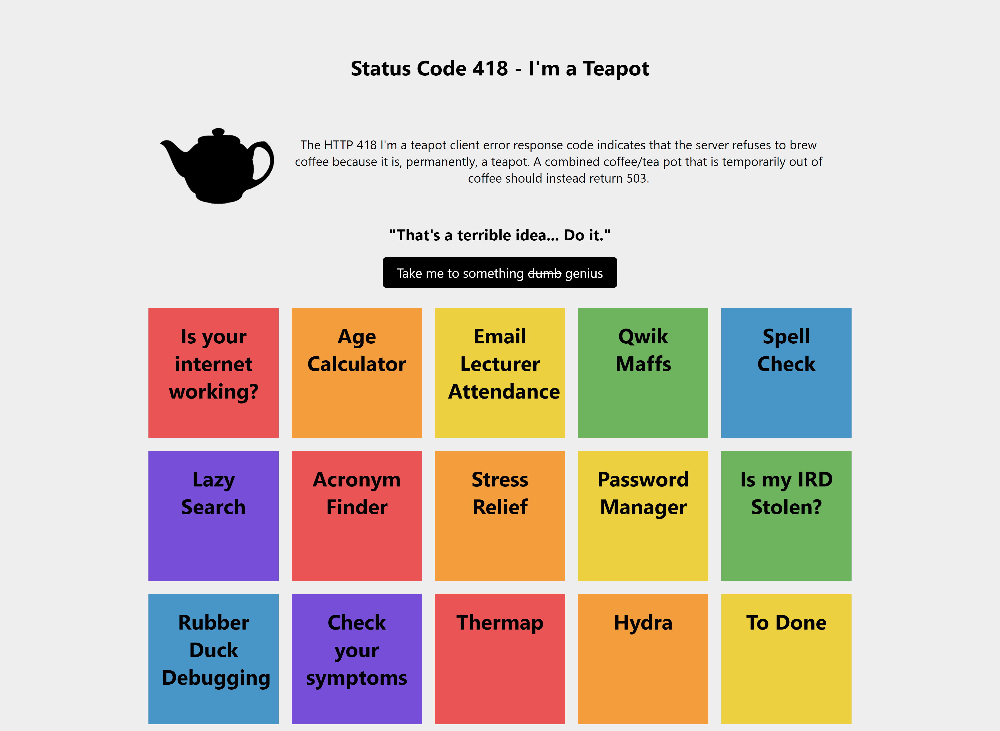

# TerribleWebsite 

TerribleWebsite is a website with multiple 'terrible projects'. Our goal is to have fun developing these websites, that serve no purpose but to make things bad for the user. 

This project was built over the weekend of 02/07/2021 - 04/07-2021, as part of the 2021 [Terrible Ideas Hackathon](https://terriblehack.nz/). 

## Project Ideas

There are a total of 15 small projects that we developed over the weekend. Each project is described in more detail below.

#### Is Your Internet Working?

This page lets you know if you are connected to the internet. 

#### Age Calculator 

By inputting your age, the website searches the world (~8 billion people) to find out how old everyone your age is.

#### Email Lecturer Attendance

Emails the lecturer to tell them you're not going to class.

#### Qwik Maffs

Put down an equation that you need help solving, to get a quick answer. No guarantees on correctness.

#### Spell Check

Not sure of your spelling? Just type out the word you're trying to spell to see if the word is correct (or wrong, the website will tell you)! 

#### Lazy Search

Input your query to Lazy Search, and a link will be generated, helping you reduce the complexity of your searches.

#### Acronym Finder

TLDR, IIRC, WYM. Does these acronyms not make any sense? LOL. Chuck down these acronyms and you'll find out!

#### Stress Relief

Are you feeling a little stressed? Click on the button!

#### Password Manager

Need a password but will probably forget it? Use a password generator! It will also make this password public, so your friends can help remind you! 

#### Is my IRD stolen?

Input your IRD number into this system, and we will check all the databases to see if it has been stolen!

#### Rubber Duck Debugging

Having problems with your code? We built a rubber duck that can help you with debugging your code!

#### Check your Symptoms

Input your symptoms and we will advise you on what's best.

#### Thermap

Tired of Google Maps? Use Thermap! Input the location, and Thermap will literally "tell" you where to go!

#### Hydra

Accidentally closed a tab? No worries! By using Hydra, when you close one tab, two will take it's place.

#### To Done

Another to do app? Yes, but this time everything you need to do will be pushed into complete straight away, leaving little to now admin work. 

## Thanks to:
[Mohammad Hassaan Mirza](https://www.linkedin.com/in/mohammad-mirza/)  
[Josh Hill](https://www.linkedin.com/in/pyxxil/)  
[Kelvin Ngor](https://www.linkedin.com/in/kelvin-ngor-513619160/)  
[Kimberley Evans-Parker](https://www.linkedin.com/in/kimberleyevans-parker/)  
[Levi Delaney](https://www.linkedin.com/mwlite/in/levi-delaney-9b2204141)  
[Mathew Seto](https://www.linkedin.com/in/mathewseto245/)  
[Ryan Tan](https://www.linkedin.com/in/rtan18/)  
[Sunny Feng](https://www.linkedin.com/in/sunnyfeng617/)  

